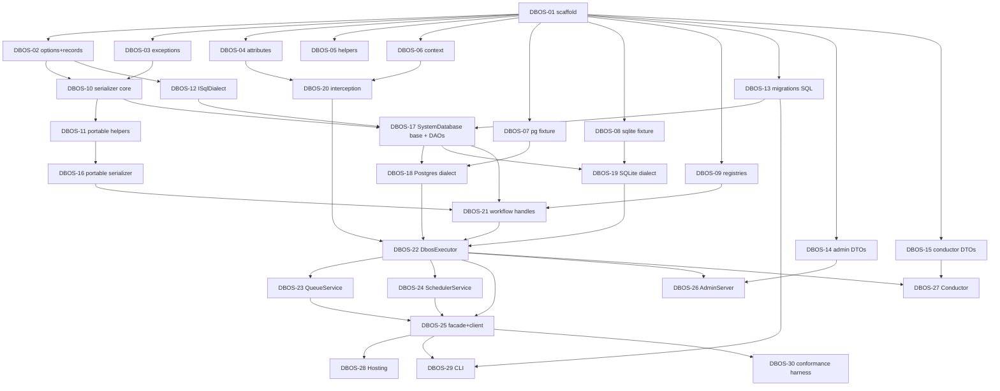

# Implementation Plan — Encapsulated Issues

This document breaks the `dbos-transact-csharp` port into independently testable issues with explicit dependencies. Issues in the same wave have no intra-wave dependencies and can be assigned to separate agents in parallel. Each issue carries a concrete test target; "done" means the deliverable compiles clean **and** its tests pass under `dotnet test`.

The port follows `dbos-transact-java` logic closely (fidelity first — idiomatic C# refactors come later). See `docs/raw/design.md` for the target repo layout, module mapping, and naming conventions.

## Wave overview

Waves are derived from the dependency DAG: an issue's wave is one more than the maximum wave of its prerequisites. Same-wave issues have no intra-wave dependencies and can run on separate agents in parallel.

| Wave | Issues | Parallelism | Theme |
|------|--------|-------------|-------|
| 1 | DBOS-01 | 1 (blocking) | solution + build + CI skeleton |
| 2 | DBOS-02, 03, 04, 05, 06, 07, 08, 09, 13, 14, 15 | up to 11 | pure primitives + test fixtures + DTOs + migration SQL |
| 3 | DBOS-10, 12, 20 | up to 3 | serializer core + dialect contract + interception |
| 4 | DBOS-11, 17 | 2 | portable serializer helpers + SystemDatabase base |
| 5 | DBOS-16, 18, 19 | 3 | portable serializer + both dialect implementations |
| 6 | DBOS-21 | 1 | workflow handles + step-result plumbing |
| 7 | DBOS-22 | 1 (blocking) | `DbosExecutor` — the durable engine |
| 8 | DBOS-23, 24, 26, 27 | 4 | queues + scheduler + admin + conductor |
| 9 | DBOS-25 | 1 (blocking) | public facade + client |
| 10 | DBOS-28, 29, 30 | 3 | hosting + CLI + (optional) conformance harness |

Critical path: DBOS-01 → 02/03 → 10 → 11 → 16 → 21 → 22 → 25 → 28/29. Everything else fans out around it. Wave 2 is the broadest parallelism opportunity (11 concurrent issues).

## Dependency graph

---

## Issues

Each issue lists its **Depends** (hard prerequisites), **Deliverable** (scope + expected files — see `docs/raw/design.md` for exact paths), and **Tests** (the automated verification without which the issue is not "done"). Keep within the scope stated; if the work grows, split it.

### DBOS-01 — Solution & build infrastructure
- **Depends**: —
- **Deliverable**: `Dbos.Transact.sln`; empty projects for `Dbos.Transact`, `Dbos.Transact.Postgres`, `Dbos.Transact.Sqlite`, `Dbos.Transact.Hosting`, `Dbos.Transact.Cli`, and test projects (`Dbos.Transact.Tests`, `Dbos.Transact.Hosting.Tests`, `Dbos.Transact.Cli.Tests`); `Directory.Build.props` (`net10.0`, nullable, warnings-as-errors, analyzers); `Directory.Packages.props` (central package management); `.editorconfig`; minimal CI workflow running `dotnet build` + `dotnet test`.
- **Tests**: `dotnet build` green. `dotnet test` runs (0 tests OK). CI workflow runs on PR.

### DBOS-02 — Options & public record types
- **Depends**: DBOS-01
- **Deliverable** (`src/Dbos.Transact/`): `DbosOptions.cs`, `StartWorkflowOptions.cs`, `Workflow/WorkflowOptions.cs`, `Workflow/StepOptions.cs`, `Workflow/ForkOptions.cs`, `Workflow/Timeout.cs`, `Workflow/WorkflowState.cs`, `Workflow/WorkflowStatus.cs`, `Workflow/WorkflowEvent.cs`, `Workflow/WorkflowStream.cs`, `Workflow/WorkflowSchedule.cs`, `Workflow/StepInfo.cs`. Immutable records where the Java source is value-shaped.
- **Tests** (`test/Dbos.Transact.Tests/Config/` + `Workflow/`): equality/record semantics, default values match Java defaults, enums map 1:1 to Java enum ordinals where persisted.

### DBOS-03 — Exception hierarchy
- **Depends**: DBOS-01
- **Deliverable** (`src/Dbos.Transact/Exceptions/`): all 10 `Dbos*Exception` types ported from Java's `DBOS*Exception`. Preserve message format and any exposed properties.
- **Tests** (`test/Dbos.Transact.Tests/` exception folder): construction + property round-trip per type; inheritance hierarchy mirrors Java; each is `[Serializable]`-safe for payload embedding.

### DBOS-04 — Public attributes
- **Depends**: DBOS-01
- **Deliverable** (`src/Dbos.Transact/Workflow/`): `WorkflowAttribute`, `StepAttribute`, `ScheduledAttribute`. Targets = Method (+Class for Scheduled if Java permits). Properties mirror Java annotation members.
- **Tests**: reflection-based — applying each attribute with valid/invalid targets; property defaults.

### DBOS-05 — Core helpers
- **Depends**: DBOS-01
- **Deliverable** (`src/Dbos.Transact/`): `Constants.cs`, `Internal/Validation.cs`, `Internal/AppVersionComputer.cs`.
- **Tests**: `AppVersionComputer` produces deterministic hash given a stable set of method signatures; hash changes when a method signature changes; order-independence where Java's is.

### DBOS-06 — Context types
- **Depends**: DBOS-01
- **Deliverable** (`src/Dbos.Transact/Context/`): `DbosContext.cs`, `WorkflowInfo.cs`, `DbosContextHolder.cs` (backed by `AsyncLocal<T>`, mirrors Java `ThreadLocal<DBOSContext>` semantics).
- **Tests**: `AsyncLocal` isolation across `Task.Run` / parallel tasks; context restoration after nested workflow; holder clears on exit.

### DBOS-07 — Postgres test fixture
- **Depends**: DBOS-01
- **Deliverable** (`test/Dbos.Transact.Tests/Fixtures/PostgresFixture.cs`): Testcontainers.NET-based fixture, exposes connection string, supports `IAsyncLifetime`, clean teardown. Include an `IClassFixture`-style parameterization hook.
- **Tests**: sanity — fixture starts, a trivial `SELECT 1` succeeds, container is disposed.

### DBOS-08 — SQLite test fixture
- **Depends**: DBOS-01
- **Deliverable** (`test/Dbos.Transact.Tests/Fixtures/SqliteFixture.cs`): file-backed temp DB + shared-cache `:memory:` variant, per-test isolation.
- **Tests**: fixture opens, closes, cleans up; WAL mode enabled where required.

### DBOS-09 — Registries
- **Depends**: DBOS-01
- **Deliverable** (`src/Dbos.Transact/Internal/`): `WorkflowRegistry.cs`, `QueueRegistry.cs`. No interception yet — just the data structure + thread-safe registration/lookup.
- **Tests**: register, look up, reject duplicates, enumerate; concurrent-registration safety.

### DBOS-10 — Serializer contract & JSON implementation
- **Depends**: DBOS-02, DBOS-03
- **Deliverable** (`src/Dbos.Transact/Json/`): `IDbosSerializer.cs`, `DbosJsonSerializer.cs` (System.Text.Json). Polymorphic support via `[JsonPolymorphic]` / `[JsonDerivedType]`.
- **Tests**: round-trip primitives, collections, records, nested polymorphic types, exceptions from DBOS-03.

### DBOS-11 — Portable serializer support types
- **Depends**: DBOS-10
- **Deliverable** (`src/Dbos.Transact/Json/`): `Boxed.cs`, `JsonWorkflowArgs.cs`, `PortableWorkflowException.cs`, `ArgumentCoercion.cs`.
- **Tests**: `Boxed<T>` preserves type identity; args round-trip; coercion covers the edge cases Java's equivalent does (null, missing field, numeric widening).

### DBOS-12 — `ISqlDialect` contract
- **Depends**: DBOS-02
- **Deliverable** (`src/Dbos.Transact/Database/ISqlDialect.cs`): interface enumerating every dialect-variant primitive — dequeue query, notify/listen verbs, JSON column type, advisory-lock, `now()` expression, timestamp encoding, multi-statement splitter. Accompanied by a stub in-memory/no-op implementation used by unit tests only.
- **Tests**: interface compiles; no-op stub satisfies contract.

### DBOS-13 — Migrations + embedded SQL
- **Depends**: DBOS-01
- **Deliverable** (`src/Dbos.Transact/Migrations/`): `MigrationManager.cs`, `Sql/Postgres/*.sql`, `Sql/Sqlite/*.sql` as embedded resources. Ports the Java schema migrations 1:1. Implements the SQLite multi-statement splitter (needed because `Microsoft.Data.Sqlite` executes one statement per call).
- **Tests**: resources load; manager lists/applies migrations idempotently against *both* fixtures (pair with DBOS-07 and DBOS-08); re-running is a no-op; schema hash matches on both dialects.

### DBOS-14 — Admin request/response DTOs
- **Depends**: DBOS-01
- **Deliverable** (`src/Dbos.Transact/Admin/` DTOs — not the server): port every request/response type from the Java admin module.
- **Tests**: JSON round-trip per DTO; backward-compat with a Java-emitted payload if one is available.

### DBOS-15 — Conductor protocol DTOs
- **Depends**: DBOS-01
- **Deliverable** (`src/Dbos.Transact/Conductor/Protocol/`): all `*Request` / `*Response` types from the Java conductor.
- **Tests**: JSON round-trip per DTO; polymorphic discriminator matches Java's.

### DBOS-16 — Portable serializer
- **Depends**: DBOS-11
- **Deliverable** (`src/Dbos.Transact/Json/DbosPortableSerializer.cs`): cross-runtime interop — round-trips with Python/TypeScript/Java DBOS runtimes. Capture golden fixtures emitted from those runtimes under `test/Dbos.Transact.Tests/Json/fixtures/{py,ts,java}/`.
- **Tests**: each fixture deserializes, re-serializes, and byte-matches (or type-matches where JSON ordering is not guaranteed). **This is the only place cross-runtime parity is enforced at the serialization level.**

### DBOS-17 — `SystemDatabase` base + DAO abstractions
- **Depends**: DBOS-10, DBOS-12, DBOS-13
- **Deliverable** (`src/Dbos.Transact/Database/`): `SystemDatabase.cs` (abstract, dialect-portable SQL + orchestration), `Daos/` — one DAO per entity (Workflow, Steps, Queues, Streams, Schedules, Notifications). Follow Python's `_sys_db.py` base + subclass pattern.
- **Tests**: unit tests via a test-double dialect that captures emitted SQL for stable snapshots; DAO method signatures covered. Full behavioral coverage comes via DBOS-18 / DBOS-19 integration tests.

### DBOS-18 — Postgres dialect implementation
- **Depends**: DBOS-17, DBOS-07
- **Deliverable** (`src/Dbos.Transact.Postgres/`): `PostgresSystemDatabase.cs` (`LISTEN`/`NOTIFY`, `SELECT … FOR UPDATE SKIP LOCKED`, `pg_try_advisory_lock`), `PostgresDialect.cs`, `DbosPostgresExtensions.cs` (`UsePostgres(connectionString)`).
- **Tests** (`test/Dbos.Transact.Tests/Database/Postgres/`, uses DBOS-07 fixture): full DAO CRUD; `LISTEN/NOTIFY` round-trip wakes a waiter within a bounded timeout; two concurrent workers dispatch via `SKIP LOCKED` without double-claim; advisory lock held by one session blocks another.

### DBOS-19 — SQLite dialect implementation
- **Depends**: DBOS-17, DBOS-08
- **Deliverable** (`src/Dbos.Transact.Sqlite/`): `SqliteSystemDatabase.cs` (polling notifications, `BEGIN IMMEDIATE`), `SqliteDialect.cs`, `DbosSqliteExtensions.cs` (`UseSqlite(connectionString)`). Handles connect-string scrubbing (`application_name` etc.), multi-statement migration splitting, ISO-8601/unix-micro timestamps, `INTEGER PRIMARY KEY AUTOINCREMENT`.
- **Tests** (`test/Dbos.Transact.Tests/Database/Sqlite/`, uses DBOS-08 fixture): full DAO CRUD; polling notification delivers within configured interval; `BEGIN IMMEDIATE` claim serializes workers correctly; migration run on a file DB re-opened cleanly.

### DBOS-20 — Interception (Castle.DynamicProxy)
- **Depends**: DBOS-04, DBOS-06
- **Deliverable** (`src/Dbos.Transact/Internal/`): `DbosInvocationInterceptor.cs` (implements `Castle.DynamicProxy.IInterceptor`), `DbosProxyFactory.cs`. Handles sync, `Task`, `Task<T>`, `ValueTask<T>` return types; propagates cancellation; preserves exception stack.
- **Tests** (`test/Dbos.Transact.Tests/Invocation/`): interface-proxy routes through interceptor; async methods complete and propagate; exceptions unwrap correctly; `CancellationToken` observed.

### DBOS-21 — Workflow handles & step result plumbing
- **Depends**: DBOS-09, DBOS-16, DBOS-17
- **Deliverable** (`src/Dbos.Transact/Workflow/`): `WorkflowHandle.cs`, `Workflow/Internal/WorkflowHandleDbPoll.cs`, `Workflow/Internal/WorkflowHandleTcs.cs`, `Workflow/Internal/StepResult.cs`, `Execution/RegisteredWorkflow.cs`, `Execution/DbosLifecycleListener.cs`.
- **Tests**: TCS-backed handle completes on set-result; DB-poll handle returns status/result from a stubbed system database; step result serialization through DBOS-16.

### DBOS-22 — `DbosExecutor`
- **Depends**: DBOS-18, DBOS-19, DBOS-20, DBOS-21
- **Deliverable** (`src/Dbos.Transact/Execution/DbosExecutor.cs`): the durable engine — invoke workflow under proxy, checkpoint per step, idempotent replay, crash-recovery from last checkpoint, exception propagation through `PortableWorkflowException`.
- **Tests** (`test/Dbos.Transact.Tests/Execution/`, **parameterized over both dialects**): workflow runs to completion and persists final status; step replayed from checkpoint returns cached result without re-executing side effects; simulated crash (dispose executor mid-flight) + new executor resumes correctly; exception in a step surfaces as a `PortableWorkflowException` on the handle.

### DBOS-23 — `QueueService`
- **Depends**: DBOS-22
- **Deliverable** (`src/Dbos.Transact/Execution/QueueService.cs`): dequeue loop, concurrency limit, per-queue metadata.
- **Tests**: dialect-parameterized enqueue/dequeue; concurrency limit observed; (PG-only) multiple workers claim distinct items via `SKIP LOCKED`; (SQLite-only) serialized claim via `BEGIN IMMEDIATE`.

### DBOS-24 — `SchedulerService`
- **Depends**: DBOS-22
- **Deliverable** (`src/Dbos.Transact/Execution/SchedulerService.cs`): cron parse/advance + long durable sleep + leadership (advisory lock / SQLite fallback).
- **Tests**: next-fire computation for representative cron expressions; long sleep survives simulated executor restart; only one leader fires a given schedule.

### DBOS-25 — Public facade, client & queue type
- **Depends**: DBOS-22, DBOS-23, DBOS-24
- **Deliverable** (`src/Dbos.Transact/`): `Dbos.cs` (static facade + fluent builder), `DbosClient.cs`, `Workflow/Queue.cs`.
- **Tests**: end-to-end smoke — configure DBOS against each dialect, register a workflow, start it, retrieve the result via handle; `DbosClient` in a separate process/connection observes the same workflow state.

### DBOS-26 — Admin HTTP server
- **Depends**: DBOS-22, DBOS-14
- **Deliverable** (`src/Dbos.Transact/Admin/AdminServer.cs`): HTTP endpoints with shapes matching Java's admin module.
- **Tests**: Kestrel-hosted ephemeral server + `HttpClient` — each endpoint returns expected JSON; error responses match Java status codes.

### DBOS-27 — Conductor (WebSocket)
- **Depends**: DBOS-22, DBOS-15
- **Deliverable** (`src/Dbos.Transact/Conductor/Conductor.cs`): `ClientWebSocket`-backed conductor client; full message round-trip.
- **Tests**: in-memory WebSocket server replays recorded Java conductor conversations; message ordering and request/response correlation verified.

### DBOS-28 — Hosting integration
- **Depends**: DBOS-25
- **Deliverable** (`src/Dbos.Transact.Hosting/`): `DbosHostingExtensions.AddDbos(cfg => …)`, `AddDbosWorkflow<TInterface, TImpl>()`, `DbosHostedService : IHostedService`, `DbosOptionsConfigurator` (`IConfiguration` binding).
- **Tests** (`test/Dbos.Transact.Hosting.Tests/`): `HostBuilder` boots DBOS against SQLite fixture; registered workflow runs; graceful shutdown flushes in-flight workflows; options bind from `IConfiguration`.

### DBOS-29 — CLI
- **Depends**: DBOS-25, DBOS-13
- **Deliverable** (`src/Dbos.Transact.Cli/`): `Program.cs` (System.CommandLine), `Commands/MigrateCommand.cs`, `Commands/ResetCommand.cs`, `Commands/WorkflowCommand.cs`, `Commands/PostgresCommand.cs`, `DatabaseOptions.cs`. Publishable as a `dotnet tool`.
- **Tests** (`test/Dbos.Transact.Cli.Tests/`): `--help` golden output; `migrate` run against both fixtures produces expected schema; `workflow list/cancel/resume` against seeded DB.

### DBOS-30 — Cross-runtime conformance harness (optional)
- **Depends**: DBOS-25
- **Deliverable** (`test/Dbos.Transact.Conformance/` — new project): scenario DSL describing a workflow + expected effects. Runs the scenario against Java DBOS and C# DBOS sharing a Postgres instance; diffs observable `dbos.*` rows + workflow outputs, normalizing timestamps/UUIDs.
- **Tests**: at least one scenario (simple workflow lifecycle) passes; the harness fails clearly when a synthetic divergence is introduced.

---

## Notes for agent assignment

- **One agent per issue.** Each issue's deliverable is scoped to non-overlapping files/folders so two agents in the same wave should not conflict on merge.
- **Java source first.** The feedback rule `feedback_port_fidelity_over_idioms.md` applies: port the Java shape before idiomatizing. Record any intentional deviation in a wiki synthesis page.
- **Tests are acceptance.** An issue is *not complete* without its tests passing. Flag any test that cannot be written as a blocker back to the orchestrator, don't quietly skip it.
- **Update the wiki.** On any port decision that isn't already captured in `docs/raw/design.md`, add or update a concept/synthesis page under `docs/wiki/` following `docs/CLAUDE.md`.
